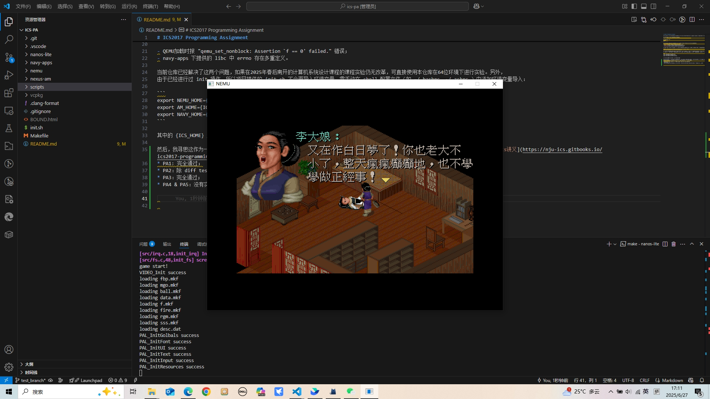

# ICS2017 Programming Assignment

This project is the programming assignment of the class ICS(Introduction to Computer System) in Department of Computer Science and Technology, Nanjing University.

For the guide of this programming assignment,
refer to http://nju-ics.gitbooks.io/ics2017-programming-assignment/content/

To initialize, run
```bash
bash init.sh
```

The following subprojects/components are included. Some of them are not fully implemented.
* [NEMU](https://github.com/NJU-ProjectN/nemu)
* [Nexus-am](https://github.com/NJU-ProjectN/nexus-am)
* [Nanos-lite](https://github.com/NJU-ProjectN/nanos-lite)
* [Navy-apps](https://github.com/NJU-ProjectN/navy-apps)

经 2025 年春南开大学计算机系统设计课程实践后，发现该项目完全可以在64位环境下运行，并不会出现太多前人提到的bug。实际遇到的问题只有两点：

- QEMU加载时报 "qemu_set_nonblock: Assertion `f == 0' failed." 错误；
- navy-apps 下提供的 libc 中 errno 存在多重定义。

当前仓库已经解决了这两个问题，如果在2025年春后南开的计算机系统设计课程的课程实验仍无改革，可直接使用本仓库在64位环境下进行实验。另外，
由于已经进行过 init 操作，所以项目提供的 init.sh 不会再导入环境变量，需手动在 shell 配置文件（如 ~/.bashrc, ~/.zshrc ）中添加环境变量导入：

```
export NEMU_HOME={ICS_HOME}/nemu
export AM_HOME={ICS_HOME}/nexus-am
export NAVY_HOME={ICS_HOME}/navy-apps
```

其中的 {ICS_HOME} 应当替换为 ics 项目的路径。

然后，我寻思这作为一个裸机模拟器，有没有依赖于 linux 的特定实现，那么 windows 也不是不能跑，遂进一步迁移到了 windows 平台。参考 [ics讲义](https://nju-ics.gitbooks.io/ics2017-programming-assignment/content/)，迁移到 windows 的过程中已经测试了：
* PA1: 完全通过；
* PA2：完全通过，需通过 MSYS2 安装 QEMU；
* PA3：完全通过；
* PA4 & PA5：没有实际测试，但它们只是对 AM 层和 nanos 的小修改，理论上只要 PA3 可以通过测试的话，它们也可以

如下，实现正确后完全可以完成 PA3 中最后的要求，即运行 PAL 程序：


迁移时使用 MSYS2 与 MinGW-w64 工具链，迁移的比较糙，不保证在其它环境配置下可以正常工作。具体配置步骤如下：

### Windows 环境配置

1.  **安装 MSYS2**:
    从 [MSYS2 官网](https://www.msys2.org/) 下载并安装。

2.  **安装 GCC**:
    打开 **MSYS2 MinGW x64** 终端，执行以下命令安装 `14.2.0` 版本的 GCC 以保证兼容性：
    ```bash
    wget https://repo.msys2.org/mingw/mingw64/mingw-w64-x86_64-gcc-14.2.0-1-any.pkg.tar.zst
    wget https://repo.msys2.org/mingw/mingw64/mingw-w64-x86_64-gcc-libs-14.2.0-1-any.pkg.tar.zst
    pacman -U mingw-w64-x86_64-gcc-14.2.0-1-any.pkg.tar.zst mingw-w64-x86_64-gcc-libs-14.2.0-1-any.pkg.tar.zst
    ```

3.  **安装依赖并设置环境变量**:
    进入项目根目录，使用 Powershell 执行以下脚本：
    ```powershell
    ./scripts/setup.ps1
    ./scripts/set-env.ps1
    ```
    执行完毕后，**重启终端**以使环境变量生效。
